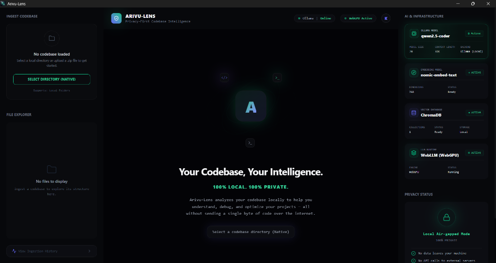
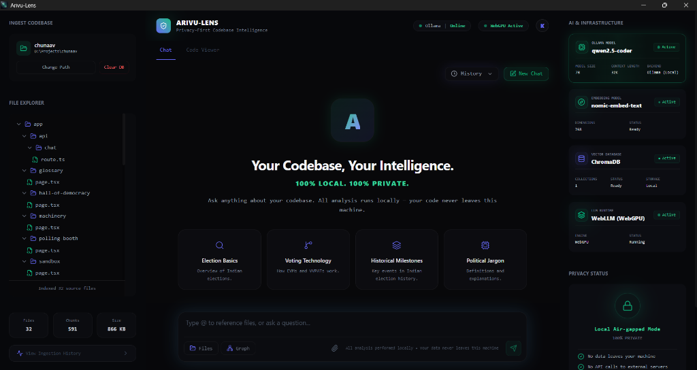
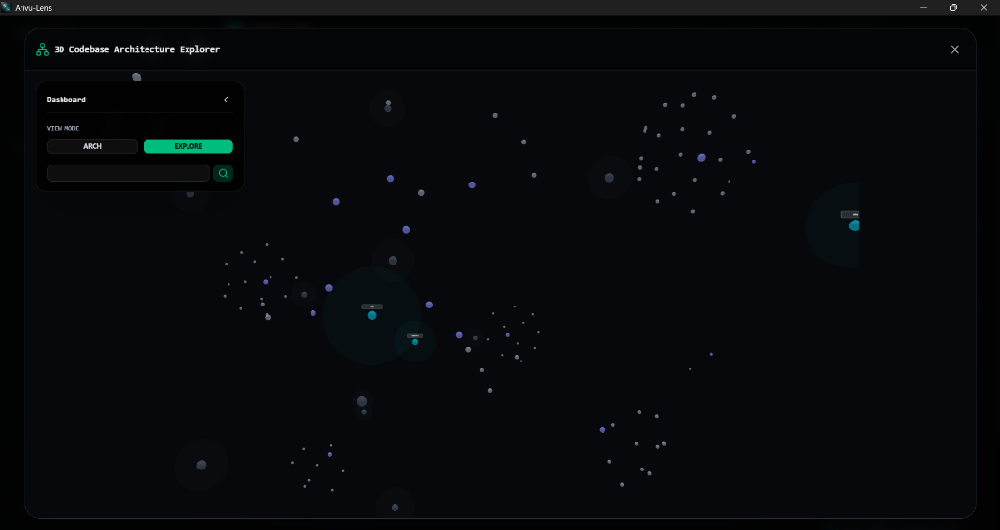

# Arivu-Lens 🔍

Arivu-Lens is an enterprise-grade, privacy-first **Local Codebase Search & AI engineering assistant**. It allows you to point the app to a local directory or drag-and-drop a ZIP folder, processes and indexes the files into a local semantic vector database, and lets you chat with an open-source model—**all without a single byte of your code ever leaving your machine**.




---

## 🎨 Upgraded 3D Codebase Architecture Explorer

Arivu-Lens includes a state-of-the-art **3D Codebase Architecture Graph** that visualizes repository structure, file hierarchies, and reference dependencies as a live network:



### 1. View Modes (Architecture vs. Exploration)
* **Architecture View**: A high-level view that filters out files and functions, showing only root packages, folders, and external libraries to expose architectural boundaries clearly.
* **Exploration View**: A granular visualizer showcasing folders, files, classes, methods, and code chunks.

### 2. Selected Node Inspector Panel
* Single-click any node to pin its inspector card in the dashboard.
* Displays name, type, and source paths.
* **Suggested Layer**: Auto-inferred layers (API Layer, Service Layer, Data Layer, UI Layer) based on folder naming heuristics.
* **Aggregated Outgoing Dependencies**: Lists top parent folder dependencies (aggregated dynamically to clean visual representation).
* **Dependents & Dependencies**: Show direct incoming and outgoing links.

### 3. Dependency-Chain Focus Mode
* Double BFS traversal highlighting the entire recursive upstream caller tree and downstream dependencies of the selected node, fading out unrelated nodes to `15%`.

### 4. Interactive Navigation & Polish
* **Strict Labels**: Always-visible high-resolution monospace labels for packages, top-level directories, searched items, and selected nodes.
* **Soft Folder Glows**: Translucent double-sided spheres wrapping folder nodes to represent directory volume and containment.
* **Jump Map**: Quick sidebar jumping links to root folders and packages.
* **Diagnostics & Diagnostics**: Live counts of Packages, Folders, Files, Classes, Functions, and **Circular Cycles** (with direct loop path readouts).

### 5. Render safeguards
* Automatically scales graphics and defaults to high-level views when graph node density exceeds 2000 nodes to keep WebGL frame rates fast and smooth.

---

## 🛠️ Technology Stack

* **Frontend**: React (TypeScript), Vite, Tailwind CSS, Lucide Icons, Three.js, React-Force-Graph-3D.
* **Backend API**: FastAPI (Python), Uvicorn.
* **Vector Store**: ChromaDB (Local Persistent Storage).
* **Embeddings Model**: `nomic-embed-text` (running locally via Ollama).
* **LLM Inference**: `qwen2.5-coder:7b` (running locally via Ollama).

---

## 🚀 Setup Instructions

Follow these steps to run Arivu-Lens completely locally.

### Step 1: Install & Set Up Ollama

1. Download and install [Ollama](https://ollama.com/) on your local machine.
2. Open a terminal (PowerShell or Command Prompt) and pull the required AI models:
   ```bash
   # Pull embedding model (highly optimized for semantic code search)
   ollama pull nomic-embed-text
   
   # Pull the local reasoning LLM (perfect for code interpretation)
   ollama pull qwen2.5-coder:7b
   ```
3. Make sure the Ollama application is running in the background (you should see the llama icon in your system tray, or you can run `ollama serve` in a terminal).

### Step 2: Run the Application (Tauri Desktop App)

Arivu-Lens is built as a highly optimized desktop application. To start it up for development:

1. Open a terminal in the root directory of the project.
2. Install the necessary frontend dependencies:
   ```bash
   cd frontend
   npm install
   cd ..
   ```
3. Install the Python backend dependencies:
   ```bash
   cd backend
   python -m venv venv
   # On Windows:
   venv\Scripts\activate
   # Install dependencies
   pip install -r requirements.txt
   cd ..
   ```
4. Start the Tauri Developer server (which automatically bundles the backend and frontend):
   ```bash
   npx @tauri-apps/cli dev
   ```

---

## 💡 How It Works (RAG Flow)

1. **Ingest**: Click "INDEX LOCAL FOLDER" to select a local directory. Files are loaded, explicitly ignoring build artifacts and directories like `.git`, `node_modules`, `target_custom`, etc.
2. **Chunk**: Code files are parsed and chunked using **Language-Aware Recursive Separators** or **Tree-Sitter AST Parsers**.
3. **Embed**: Chunks are sent to the local Ollama `/api/embed` endpoint.
4. **Store**: Vectors are written directly to a local, persistent **ChromaDB** database on your local disk.
5. **Retrieve**: When you ask a question in the Chat Tab, your query retrieves the top most mathematically relevant source snippets from your codebase.
6. **Synthesize & Stream**: The retrieved code chunks are injected into a strict system developer prompt, and the AI model streams the answer back to your chat window, backing up all claims with exact code snippets and allowing you to open the sources in the **Code Viewer Tab**.

---

## 🔒 100% Privacy Guard

Arivu-Lens runs entirely within your localhost environment:
* No external API keys required.
* Zero external network calls are made.
* Code indexing, chunking, embedding, vector search, and model inference are strictly local.

